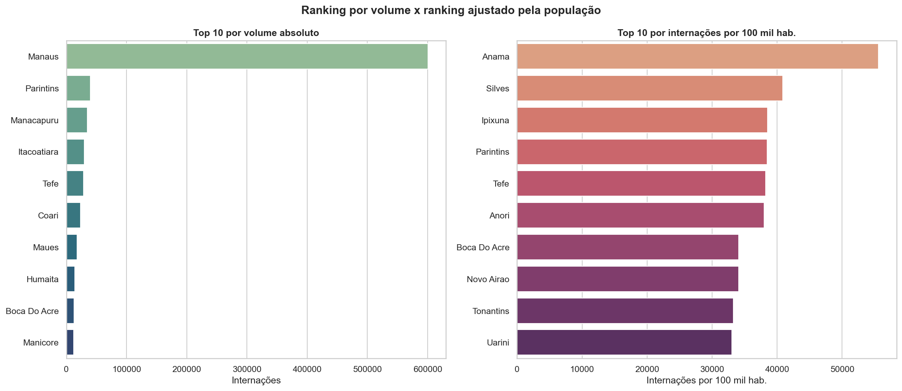
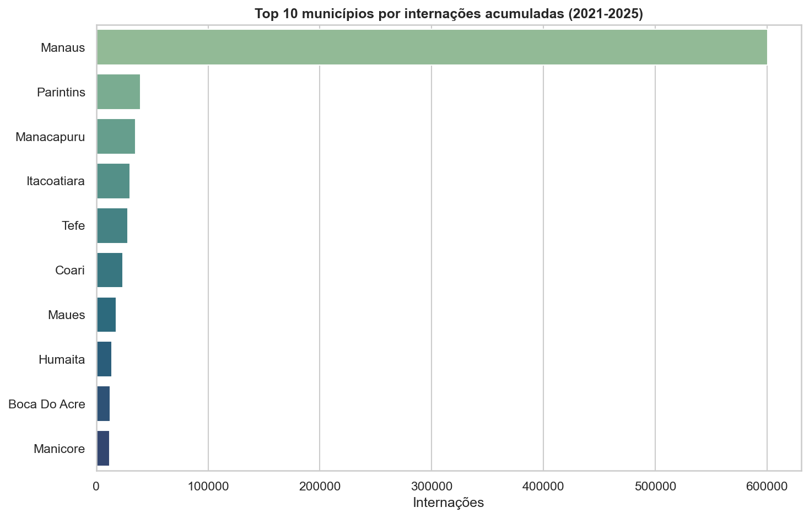
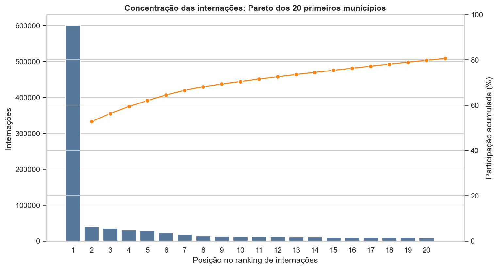
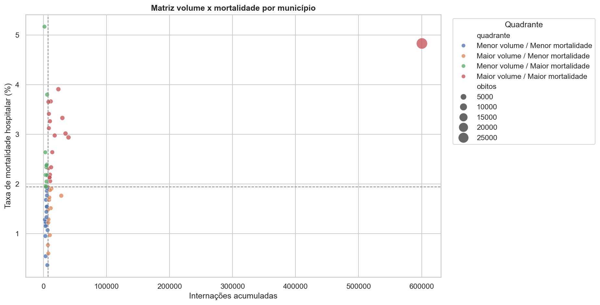

# EDA DataSUS: Morbidade Hospitalar no Amazonas


Análise exploratória de dados de morbidade hospitalar do SUS para residentes no Amazonas, com foco em município, faixa etária, ano, concentração territorial e mortalidade hospitalar.

O objetivo do projeto é demonstrar um fluxo completo de análise de dados: coleta em fonte pública, limpeza, transformação, geração de indicadores, visualização e síntese interpretativa.



## Perguntas orientadoras

- Como as internações hospitalares evoluíram entre 2021 e 2025?
- Quais municípios concentram a maior parte da demanda hospitalar registrada no SIH/SUS?
- Quais faixas etárias concentram maior volume de internações?
- A mortalidade hospitalar acompanha o volume de internações ou revela outro padrão?
- O ranking por volume muda quando as internações são ajustadas pela população?
- Que limitações precisam ser consideradas antes de transformar a análise em decisão?

## Fonte dos dados

Os dados foram obtidos no **DATASUS/TABNET**, em:

- Portal: [Morbidade Hospitalar do SUS (SIH/SUS)](https://datasus.saude.gov.br/acesso-a-informacao/morbidade-hospitalar-do-sus-sih-sus/)
- Formulário TABNET usado pelo script: `http://tabnet.datasus.gov.br/cgi/deftohtm.exe?sih/cnv/nram.def`
- População municipal: API de agregados do IBGE, com Censo 2022 e estimativas populacionais
- Abrangência: Amazonas
- Recorte: morbidade hospitalar por local de residência
- Arquivos baixados: períodos de processamento de Jan/2021 a Fev/2026
- Análise principal: anos completos de atendimento de 2021 a 2025

## Estrutura

```text
.
├── data/
│   ├── raw/          # CSVs baixados do TABNET
│   └── processed/    # CSVs limpos gerados pelo notebook
├── notebooks/
│   └── eda_datasus_amazonas.ipynb
├── scripts/
│   ├── download_tabnet.py
│   ├── download_population_ibge.py
│   └── create_notebook.py
├── app.py
├── requirements.txt
├── LICENSE
└── README.md
```

## Metodologia

1. Download de tabelas agregadas do TABNET em formato `prn`, separado por `;`.
2. Padronização dos arquivos como CSV UTF-8 com metadados de fonte.
3. Limpeza no notebook:
   - remoção da linha `Total` para evitar dupla contagem;
   - conversão de entidades HTML, como `Munic&iacute;pio`;
   - transformação de anos em formato longo;
   - conversão de `-` para zero;
   - conversão de tipos numéricos e taxa com vírgula decimal;
   - separação do código IBGE e nome do município.
4. Integração da população municipal do IBGE.
5. Cálculo de indicadores por ano, município, faixa etária, mortalidade e taxa por 100 mil habitantes.
6. Análise de concentração territorial, crescimento municipal, ranking volume x taxa populacional e matriz volume x mortalidade.
7. Visualização com Seaborn/Matplotlib e exportação dos gráficos para `data/processed/`.

## Como executar

Crie e ative um ambiente virtual:

```bash
python -m venv .venv
```

No Windows:

```bash
.venv\Scripts\activate
```

No Linux/macOS:

```bash
source .venv/bin/activate
```

Instale as dependências:

```bash
python -m pip install -r requirements.txt
```

Para baixar novamente os dados:

```bash
python scripts/download_tabnet.py
python scripts/download_population_ibge.py
```

Depois abra e execute:

```bash
jupyter notebook notebooks/eda_datasus_amazonas.ipynb
```

O notebook também gera arquivos limpos em `data/processed/`.

Para abrir o dashboard Streamlit:

```bash
streamlit run app.py
```

## Achados principais

- Entre 2021 e 2025, foram observadas **1.137.197 internações** de residentes no Amazonas.
- O total anual subiu de **215.288 internações em 2021** para **261.018 em 2025**, crescimento de aproximadamente **21,2%**.
- **Manaus concentrou 52,8%** das internações do período, seguida por Parintins, Manacapuru, Itacoatiara e Tefé.
- As faixas etárias com maior volume foram **20 a 29 anos** e **30 a 39 anos**.
- A taxa média de mortalidade hospitalar foi mais alta nas faixas **80 anos e mais**, **70 a 79 anos** e **60 a 69 anos**.
- A análise de Pareto reforça a concentração territorial da demanda hospitalar.
- O ranking por 100 mil habitantes complementa o ranking absoluto e destaca municípios menores com maior pressão proporcional.
- A matriz volume x mortalidade mostra que municípios com maior volume absoluto de óbitos não são necessariamente os de maior mortalidade proporcional.

## Exemplos de visualização








## Dados gerados

Além dos CSVs brutos em `data/raw/`, o notebook exporta bases tratadas e resumos em `data/processed/`, incluindo:

- `municipios_tratados.csv`
- `ranking_municipios.csv`
- `ranking_volume_vs_taxa.csv`
- `crescimento_municipios.csv`
- `matriz_volume_mortalidade.csv`
- `resumo_faixa_etaria.csv`
- `resumo_ano.csv`
- `populacao_municipios_am_tratada.csv`

Esses arquivos evidenciam a etapa de integração e transformação dos dados para uso em análises.

O dicionário das principais colunas está disponível em [docs/dicionario_dados.md](docs/dicionario_dados.md).

## Avaliação técnica

Uma leitura técnica do projeto, com pontos fortes, limitações e próximos passos, está disponível em [docs/avaliacao_tecnica.md](docs/avaliacao_tecnica.md).

## Observações

Os dados representam internações registradas no SIH/SUS e não incluem todo o atendimento privado fora do SUS. Como 2026 ainda está incompleto no momento do download, os gráficos e conclusões anuais usam 2021 a 2025.

As taxas por 100 mil habitantes usam população municipal do IBGE. Para 2023, o projeto usa interpolação linear entre o Censo 2022 e a estimativa 2024, porque a série de estimativas municipais consultada não traz 2023 no mesmo agregado. Mesmo com esse ajuste, os resultados não controlam estrutura etária, oferta hospitalar ou fluxo regional de pacientes.
